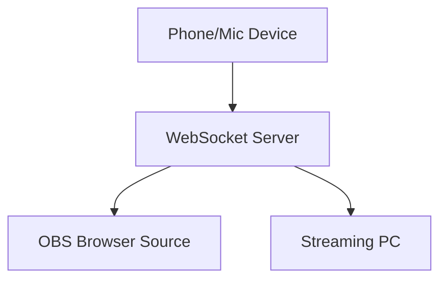

# OBS Overlays

A lightweight PNGTuber system for streamers, designed to work with OBS browser sources. Uses WebSockets to sync microphone input between devices without heavy 3D software.

[](https://render.com/deploy)

## Features

- 👄 Phone-to-PC animation sync (mic triggers avatar lip-sync only)  
- 🖥️ Browser-based - no local software installation  
- 🚫 No tracking/analytics  
- 🔌 WebSocket-powered real-time animation  
- 📱 Mobile-friendly control panel  
- 🔊 *Note: Requires separate OBS microphone for actual audio*

## Why Render?

This system requires WebSocket support which isn't available on:
- ❌ Vercel
- ❌ GitHub Pages
- ❌ Traditional static hosts

Render's free tier provides:
- ✅ WebSocket support
- ✅ 24/7 uptime (no sleep mode)
- ✅ 512MB RAM (sufficient for light usage)

## Installation

### 1. One-Click Deployment
[](https://render.com/deploy)  
*(Free tier sufficient for personal use)*

### 2. Manual Setup
```bash
# Clone repository
git clone https://github.com/yourusername/obs-overlays.git

# Install dependencies
pip install -r requirements.txt

# Start server locally
gunicorn -w 4 -k gevent -b 0.0.0.0:8000 app:app
```

## OBS Setup

1. **Add Browser Sources**:
   - **Sender Page**: `https://your-render-url.onrender.com/pngtuber/v2/microphone`
   - **Receiver Page**: `https://your-render-url.onrender.com/pngtuber/v2/display`

2. **Recommended Settings**:
   ```ini
   Width: 1920
   Height: 1080
   Custom CSS: body { background-color: rgba(0, 0, 0, 0); }
   ```

## Troubleshooting

| Issue                          | Solution                          |
|--------------------------------|-----------------------------------|
| Microphone not working         | Allow microphone access in browser|
| WebSocket errors               | Ensure Render service is running  |
| Avatar not animating           | Check both pages use HTTPS        |

## Technical Details

**Requirements**:
- Python 3.9+
- Flask-SocketIO
- Modern browser (Chrome 90+/Edge 90+)

**Architecture**:


## Credits

- Original PNGTuber concept: [jeremyyysan](https://jeremyyysan.gumroad.com/l/abvbr)
- WebSocket implementation inspired by [Flask-SocketIO](https://flask-socketio.readthedocs.io/)

## License

[MIT](https://choosealicense.com/licenses/mit/)
